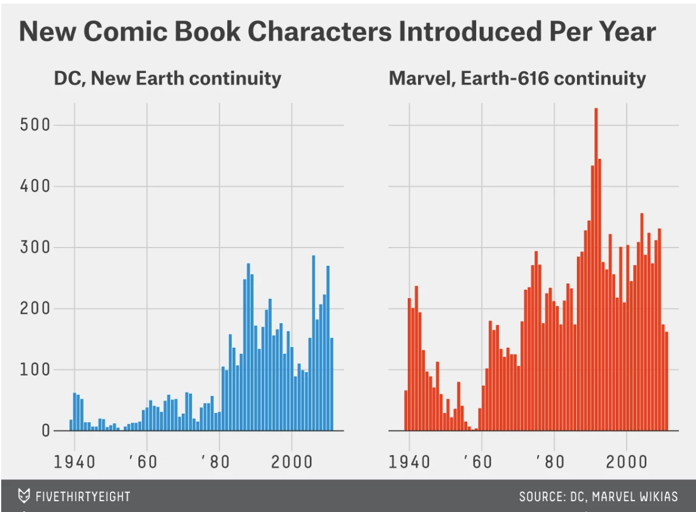

```{r setup, include=FALSE}
knitr::opts_chunk$set(echo = TRUE)
```

**Setting up and loading packages into R via library**
```{r}
library(knitr)
library(magrittr)
library(ggplot2)
library(dplyr)
library(gridExtra)
library(grid)
```


---------------------------------------------------------------------------------------------------
## Part I

The article of the data graphics, which I decided to recreate can be accessed via this link:
https://fivethirtyeight.com/features/women-in-comic-books/

The data visualisation I recreated is the following:
```{r}

```


First we need to read the downloaded CSV files and assign them to variables to wrangle the data.Each corresponds to data on comic characters from DC and Marvel. 
```{r}
dc <- read.csv("dc-wikia-data.csv")
marvel <- read.csv("marvel-wikia-data.csv")
```

The data is wrangled as shown in the code below. Because there should be two bar graphs for each publisher DC and Marvel, they were assigned to two different variables. The data shows the aggragate number of male, female and gender non-conforming characters released each year. 
```{r}
charint_dc <- dc %>% # Characters in DC comics
  group_by(YEAR) %>% # For every year
  summarize(n=n()) # Summarised as the total number of characters introduced every year

charint_m <- marvel %>% # Characters in Marvel comics
  group_by(Year) %>% # For every year
  summarize(n=n()) # Summarised as the total number of characters introduced every year

# Plotting the number of DC comics characters introduced every year
charint_dc_plot <- ggplot(charint_dc,aes(x=YEAR,y=n))+geom_bar(stat="identity",fill="#0F94E0")+scale_x_continuous(breaks=seq(1940,2013,20))+theme(axis.title.x=element_blank(),axis.title.y=element_blank(),plot.background = element_rect(fill = "grey92"),panel.grid.major = element_line(size = 0.5, linetype = 'solid',colour = "grey"),panel.grid.minor = element_blank())+ggtitle("DC, New Earth continuity")+ylim(0,500)

# Plotting the number of Marvel comics characters introduced every year
charint_m_plot <- ggplot(charint_m,aes(x=Year,y=n))+geom_bar(stat="identity",fill="#D84408")+scale_y_continuous(breaks=c(0,110,220,330,440,550))+theme(axis.title.x=element_blank(), axis.text.y=element_blank(),axis.title.y=element_blank(),axis.ticks.y = element_blank(),plot.background = element_rect(fill = "grey92"),panel.grid.major = element_line(size = 0.5, linetype = 'solid',colour = "grey"),panel.grid.minor = element_blank())+ggtitle("Marvel, Earth-616 continuity")

# Combining the two plots on a grid, changing the background color, and adding title
grid.arrange(charint_dc_plot, charint_m_plot,top = textGrob("New Comic Book Characters Introduced Per Year",gp=gpar(fontsize=20,font=2)),nrow = 1)
```

The visual I have recreated contains numeric variables and categorical variables. The numeric variables of the data graphic contain the number of comic book characters on the y-axis that start at 0 and the year on the x-axis that start at 1940. The axis title have been removed to resemble the original graphic. To be more specific, the number of people are represented in a bar graph by the length. As you can see, the y-axis text for "Marvel, Earth-616 continuity" has been removed as well because the y-axis scale is identical to the graph for DC comics and the two graphs are plotted side-by-side. Next, the categorical variables are the two categories of DC and Marvel represented by different qualitative colors in different bar graphs. Both bar graphs are plotted in a cartesian plane with axes mentioned earlier. Last but not least, the data graphic contains the title for the grid and subtitles for each plot. The minor gridlines are eliminated for a more convenient visual.